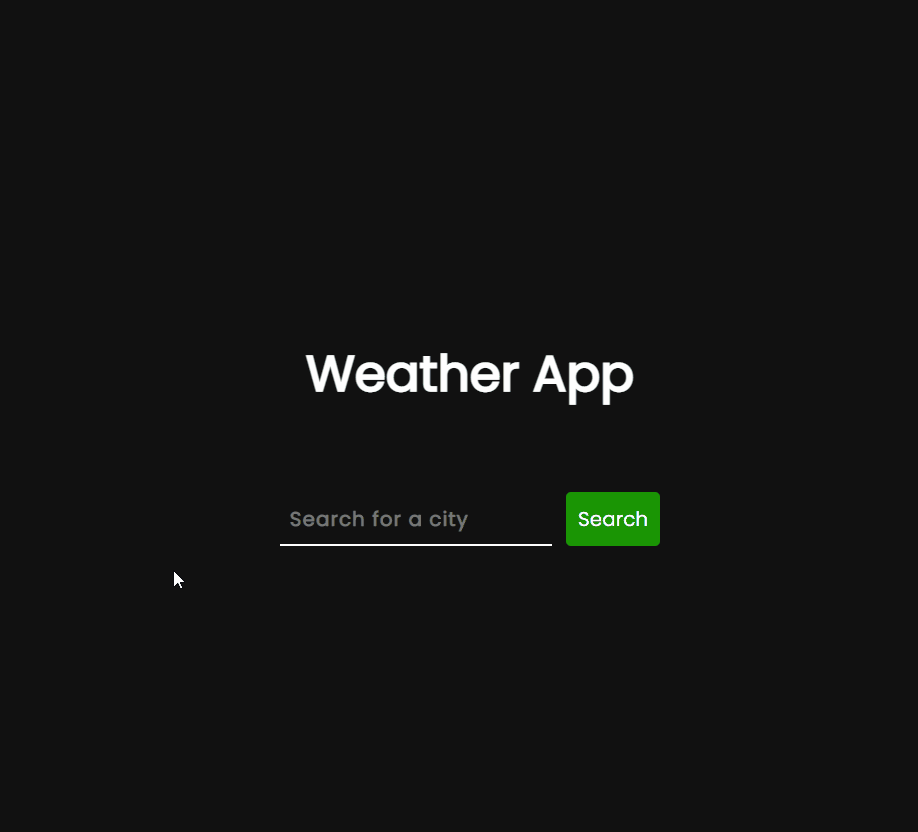

# Weather App

## Demo 📸

<div>
                                                               
</div>

---
                                                                                                                                                                                                                            

## 💻 About The Project
This project is a javascript application that displays the climate data of the chosen city.<br> Data received from <a href="https://openweathermap.org/">OpenWeatherAPI</a>.

<br>

## 🛠 Tecnologies 
✔️HTML

✔️CSS

✔️JAVASCRIPT
    
<br>

## 🚀 How To Test ?
You can test the project using this command:

```
git clone https://github.com/lucassoares72/WeatherApp.git
```
